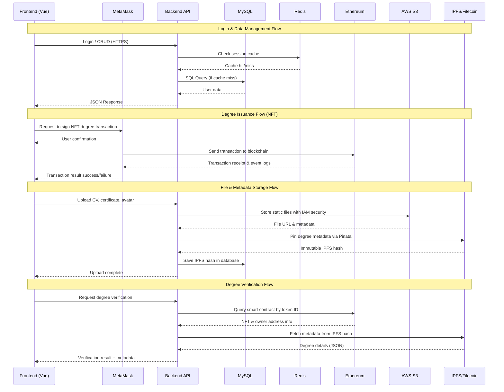

# **EduBridgeTrace**
### *Decentralized Degree & Recruitment Management Platform*  
> *“Connect – Authenticate – Empower”*

[](LICENSE)  

---

## 📖 Overview

**EduBridgeTrace** is an open-source project that combines **Web2** technologies (Laravel, MySQL, Redis) with **Web3** (Ethereum, IPFS, Filecoin) to build a transparent and tamper-proof academic certification and recruitment ecosystem.

Three main target groups:

| 👩‍🏫 Lecturer | 🎓 Student | 💼 School |
|----------------|-------------|-------------------|
| Issue and verify certificates | Store & share immutable records | Ensure academic quality, connect inter-school |

---

## 🏗️ System Architecture


| Layer | Main Technologies | Role | Highlights |
|-------|-------------------|------|-----------|
| **Frontend** | Vue 3, Bootstrap 5 | SPA interface for 3 user types | Fast response, multi-device |
| **Web3 Gateway** | `web3.js` / `ethers.js` + MetaMask | Sign & send transactions, read blockchain | Familiar UX, private key security |
| **Cache** | AWS ElastiCache (Redis) | Key-value store, pub/sub | Speeds up queries, session storage |
| **Backend (Containers)** |Laravel | API REST/GraphQL, nghiệp vụ, queue workers | Apache / Nginx |
| **Database** | AWS RDS (MySQL 8) | Relational data (users, courses, recruitment) | Automated backup, Multi-AZ |
| **Object Storage** | AWS S3 | Static frontend files, CVs, media | IAM security, versioning |
| **Smart Contracts** | Solidity + OpenZeppelin | NFT-degree, utility token | Deployed on Ethereum & Testnet |
| **Distributed Storage** | IPFS + Pinata | Store degree metadata, large files | Immutable hash, free CDN gateway |
| **Long-term Storage** | Filecoin | Storage deal for “hot” data | Durability commitment, low cost |

---

## 🔄 Data Flow



### Explanation of Main Flows:

1. **Authentication & Management**: Sessions are cached in Redis to reduce database load.
2. **Blockchain Integration**: MetaMask handles the digital signature, ensuring private key security.
3. **Distributed Storage**: Large files → S3, small metadata → IPFS, ensuring immutability.
4. **Instant Verification**: Combining on-chain data + IPFS content for high trustworthiness.

## ⚙️ System Requirements
| Software     | Minimum Version       |
| ------------ | --------------------- |
| **Laravel**   | 12x                  |
| **Node.js**  | >=6.0.0                |
| **Npm**     | 10.9.2                 |
| **MetaMask** | 11.x (Chrome/Firefox) |
| **Axios** | 1.8.2 |
| **Vite** | 6.2.4 |

## 🚀 Quick Setup

### 🌐 Production

```bash
# 1. Clone source code
git clone git@gitlab.com:ThanhTruong2311/blockchain_dtudz.git
cd blockchain_dtudz

# 2. Create config file
cp .env.example .env
# ✏️ Fill in Database, RPC endpoints, Pinata API key

# 3. Build & Deploy
./scripts/deploy-ecs.sh

```

### 💻 Local Development

#### Backend Setup
```bash
composer i 
npm i
php artisan migrate
php artisan db:seed
npm run watch
php artisan server
```


### Demo Accounts
You can use the following accounts for demo:

**ADMIN :**

- Email: admin@gmail.com
- Password: 123456

**STUDENT :**

***Account 1***
- Email: anh.nm220001@dtu.edu.vn
- Password: 123456

***Account 2***
- Email: binh.tv220002@sis.hust.edu.vn
- Password: 123456

**SCHOOL:**

***Account 1***
- Email: admin@dtu.edu.vn
- Password: 123456

***Account 2***
- Email: admin@uet.vnu.edu.vn
- Password: 123456

**LECTURER:**

***Account 1***
- Email: nguyenquoclong@dtu.edu.vn
- Password: 123456


***Account 2***
- Email: lehoangnam@hust.edu.vn
- Password: 123456

**BUSINESS:**

***Account 1***
- Email: hr@fpt.com.vn
- Password: 123456

***Account 2***
- Email: tuyen.dung@viettel.com.vn
- Password: 123456

## 🧑‍💻 Contribution

```bash
# 1. Fork the repository and clone to local
git clone git@gitlab.com:ThanhTruong2311/blockchain_dtudz.git
cd blockchain_dtudz

# 2. Create a new branch for the feature
git checkout -b feat/my-awesome-feature

# 3. Commit following Conventional Commits
git add .
git commit -m "feat: add new awesome feature"

# 4. Push and create a Pull Request
git push origin feat/my-awesome-feature
# 🔀 Create a Pull Request on GitLab
```

### 📋 Contribution Guidelines
- ✅ Follow [Conventional Commits](https://www.conventionalcommits.org/)
- ✅ Write tests for new code
- ✅ Ensure code passes all CI/CD checks
- ✅ Update documentation if needed


## 👥 Team Members
| Role      | Name                    | Email                                                                 |
| --------- | ----------------------- | --------------------------------------------------------------------- |
| Leader    | **Nguyễn Quốc Long**     | [quoclongdng@gmail.com](mailto:quoclongdng@gmail.com)                 |
| Developer | **Lê Thanh Trường**      | [thanhtruong23111999@gmail.com](mailto:thanhtruong23111999@gmail.com) |
| Developer | **Võ Văn Việt**          | [vietvo371@gmail.com](mailto:vietvo371@gmail.com)                     |
| Developer | **Nguyễn Văn Nhân**      | [vannhan130504@gmail.com](mailto:vannhan130504@gmail.com)             |
| Developer | **Nguyễn Ngọc Duy Thái** | [kkdn011@gmail.com](mailto:kkdn011@gmail.com)                         |


## 📜 License
Released under the MIT License – see LICENSE file for details.


© 2025 EduBridgeTrace – Build trust, unlock opportunity.


