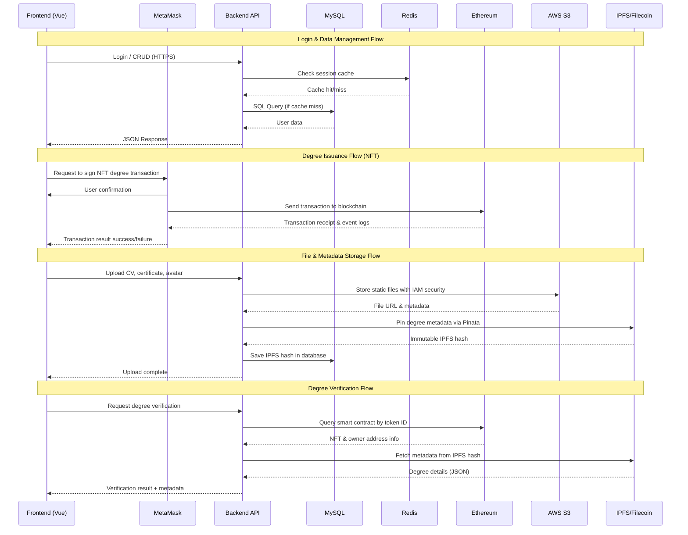

# Kiến trúc EduBridgeTrace

## 🏗️ Tổng quan hệ thống

EduBridgeTrace được thiết kế theo mô hình đa tầng, kết hợp công nghệ Web2 và Web3 để xây dựng một hệ sinh thái chứng nhận học thuật và tuyển dụng hoàn chỉnh.

## 🔄 Luồng dữ liệu

## 🔄 Chi tiết các luồng xử lý

### 1. Luồng đăng nhập & quản lý dữ liệu
- UI->BE: Login / CRUD (HTTPS)
- BE->RS: Kiểm tra cache phiên
- RS->BE: Cache hit/miss
- BE->RDS: Truy vấn SQL (nếu cache miss)
- RDS->BE: Dữ liệu người dùng
- BE->UI: Phản hồi JSON

### 2. Luồng phát hành bằng cấp (NFT)
- UI->MM: Yêu cầu ký giao dịch NFT
- MM->UI: Xác nhận từ người dùng
- MM->ETH: Gửi giao dịch lên blockchain
- ETH->MM: Biên nhận giao dịch & log sự kiện
- MM->UI: Kết quả giao dịch thành công/thất bại

### 3. Luồng lưu trữ file & metadata
- UI->BE: Upload CV, chứng chỉ, avatar
- BE->S3: Lưu file tĩnh với bảo mật IAM
- S3->BE: URL file & metadata
- BE->IPFS: Pin metadata bằng cấp qua Pinata
- IPFS->BE: Hash IPFS bất biến
- BE->RDS: Lưu hash IPFS vào database
- BE->UI: Hoàn tất upload

### 4. Luồng xác thực bằng cấp
- UI->BE: Yêu cầu xác thực bằng cấp
- BE->ETH: Truy vấn smart contract bằng token ID
- ETH->BE: Thông tin NFT & địa chỉ chủ sở hữu
- BE->IPFS: Lấy metadata từ hash IPFS
- IPFS->BE: Chi tiết bằng cấp (JSON)
- BE->UI: Kết quả xác thực + metadata

## 🔧 Các thành phần chính

### 1. Frontend Layer
- **Framework**: Vue 3
- **UI Framework**: Bootstrap 5
- **Features**:
  - SPA interface cho 3 loại người dùng
  - Responsive design
  - Web3 integration

### 2. Web3 Gateway
- **Libraries**: web3.js / ethers.js
- **Wallet**: MetaMask integration
- **Features**:
  - Ký và gửi giao dịch
  - Đọc dữ liệu blockchain
  - Quản lý private key

### 3. Cache Layer
- **Service**: AWS ElastiCache (Redis)
- **Usage**:
  - Key-value store
  - Session storage
  - Pub/sub messaging
  - Cache query results

### 4. Backend Layer
- **Framework**: Laravel
- **Server**: Apache/Nginx
- **Features**:
  - REST/GraphQL API
  - Business logic
  - Queue workers
  - Authentication

### 5. Database Layer
- **Service**: AWS RDS (MySQL 8)
- **Features**:
  - Relational data storage
  - Automated backups
  - Multi-AZ deployment
  - High availability

### 6. Object Storage
- **Service**: AWS S3
- **Usage**:
  - Static frontend files
  - User uploads (CV, media)
  - IAM security
  - Versioning support

### 7. Blockchain Layer
- **Platform**: Ethereum & Testnet
- **Contracts**:
  - NFT-degree contract
  - Utility token contract
- **Framework**: OpenZeppelin

### 8. Distributed Storage
- **Primary**: IPFS + Pinata
- **Secondary**: Filecoin
- **Features**:
  - Immutable storage
  - Content addressing
  - CDN gateway
  - Long-term archival

## ⚙️ System Requirements

| Software     | Minimum Version       |
| ------------ | --------------------- |
| **Laravel**   | 12x                  |
| **Node.js**  | >=6.0.0              |
| **Npm**      | 10.9.2               |
| **MetaMask** | 11.x (Chrome/Firefox)|
| **Axios**    | 1.8.2                |
| **Vite**     | 6.2.4                |

## 🔐 Bảo mật

### Authentication
- JWT tokens
- MetaMask signatures
- Multi-factor auth

### Data Security
- Encryption at rest
- HTTPS everywhere
- IAM policies

### Access Control
- Role-based access
- Smart contract permissions
- API rate limiting

## 📈 Khả năng mở rộng

### Horizontal Scaling
- Load balancing
- Database replication
- Cache distribution

### Vertical Scaling
- Instance upgrades
- Storage optimization
- Performance tuning

## 🔄 Backup & Recovery

### Data Backup
- RDS automated backups
- S3 versioning
- Blockchain immutability

### Disaster Recovery
- Multi-region deployment
- Failover procedures
- Data restoration plan

## 📝 Documentation

### Technical Docs
- API documentation
- Smart contract specs
- Database schema

### User Guides
- Student manual
- Teacher guide
- Admin documentation

## 📝 License
Dự án được phân phối dưới giấy phép [MIT License](/LICENSE)

## 🪜 Hệ thống
Thiết kế theo kiến trúc như hình vẽ bên dưới:

## 👥 Đối tượng người dùng

| 👩‍🏫 Giảng viên | 🎓 Sinh viên | 💼 Nhà trường | 🏢 Nhà tuyển dụng |
|----------------|-------------|-------------------|-------------------|
| Phát hành và xác minh chứng chỉ | Lưu trữ & chia sẻ hồ sơ bất biến | Đảm bảo chất lượng học thuật | Xác thực & đánh giá ứng viên |

## 💡 Tính năng chính

### 🎓 Quản lý văn bằng
- Phát hành chứng chỉ NFT
- Xác minh tức thì
- Lưu trữ phi tập trung

### 👥 Tuyển dụng
- Hồ sơ ứng viên blockchain
- Xác thực tự động
- Kết nối doanh nghiệp-trường

### 🤝 Liên kết trường
- Chia sẻ dữ liệu học thuật
- Chuyển tiếp tín chỉ
- Xác thực liên trường

## 📞 Liên hệ

| Role      | Name                    | Email                                                                 |
| --------- | ----------------------- | --------------------------------------------------------------------- |
| Leader    | **Nguyễn Quốc Long**     | [quoclongdng@gmail.com](mailto:quoclongdng@gmail.com)                 |
| Developer | **Lê Thanh Trường**      | [thanhtruong23111999@gmail.com](mailto:thanhtruong23111999@gmail.com) |
| Developer | **Võ Văn Việt**          | [vietvo371@gmail.com](mailto:vietvo371@gmail.com)                     |
| Developer | **Nguyễn Văn Nhân**      | [vannhan130504@gmail.com](mailto:vannhan130504@gmail.com)             |
| Developer | **Nguyễn Ngọc Duy Thái** | [kkdn011@gmail.com](mailto:kkdn011@gmail.com)                         |

*"Được phát triển với ❤️ bởi Nhóm DTU-DZ"*
