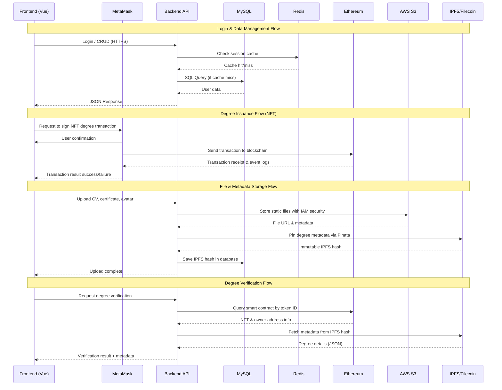
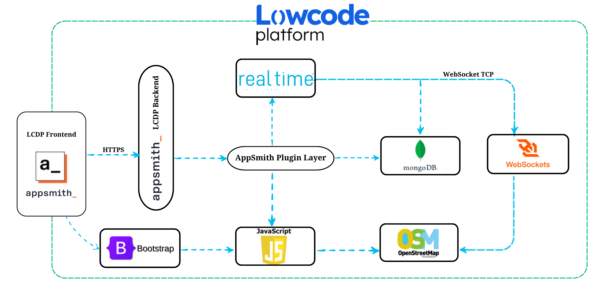
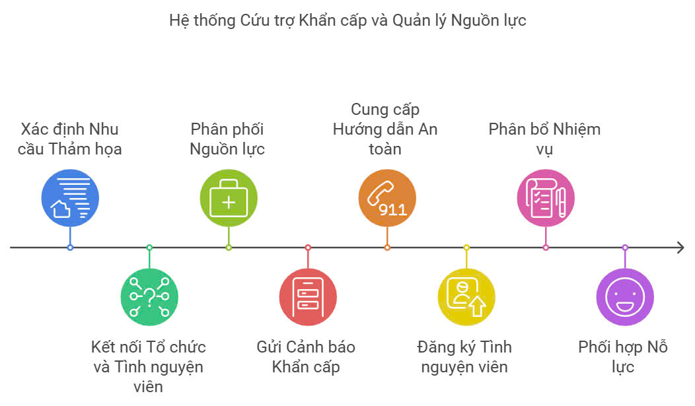

# Kiến trúc EduBridgeTrace

## 🏗️ Tổng quan hệ thống

EduBridgeTrace được thiết kế theo mô hình đa tầng, kết hợp công nghệ Web2 và Web3 để xây dựng một hệ sinh thái chứng nhận học thuật và tuyển dụng hoàn chỉnh.

## 🔄 Luồng dữ liệu

## 🔧 Các thành phần chính

### 1. Frontend Layer
- **Framework**: Vue 3
- **UI Framework**: Bootstrap 5
- **Features**:
  - SPA interface cho 3 loại người dùng
  - Responsive design
  - Web3 integration

### 2. Web3 Gateway
- **Libraries**: web3.js / ethers.js
- **Wallet**: MetaMask integration
- **Features**:
  - Ký và gửi giao dịch
  - Đọc dữ liệu blockchain
  - Quản lý private key

### 3. Cache Layer
- **Service**: AWS ElastiCache (Redis)
- **Usage**:
  - Key-value store
  - Session storage
  - Pub/sub messaging
  - Cache query results

### 4. Backend Layer
- **Framework**: Laravel
- **Server**: Apache/Nginx
- **Features**:
  - REST/GraphQL API
  - Business logic
  - Queue workers
  - Authentication

### 5. Database Layer
- **Service**: AWS RDS (MySQL 8)
- **Features**:
  - Relational data storage
  - Automated backups
  - Multi-AZ deployment
  - High availability

### 6. Object Storage
- **Service**: AWS S3
- **Usage**:
  - Static frontend files
  - User uploads (CV, media)
  - IAM security
  - Versioning support

### 7. Blockchain Layer
- **Platform**: Ethereum & Testnet
- **Contracts**:
  - NFT-degree contract
  - Utility token contract
- **Framework**: OpenZeppelin

### 8. Distributed Storage
- **Primary**: IPFS + Pinata
- **Secondary**: Filecoin
- **Features**:
  - Immutable storage
  - Content addressing
  - CDN gateway
  - Long-term archival

## ⚙️ System Requirements

| Software     | Minimum Version       |
| ------------ | --------------------- |
| **Laravel**   | 12x                  |
| **Node.js**  | >=6.0.0              |
| **Npm**      | 10.9.2               |
| **MetaMask** | 11.x (Chrome/Firefox)|
| **Axios**    | 1.8.2                |
| **Vite**     | 6.2.4                |

## 🔐 Bảo mật

### Authentication
- JWT tokens
- MetaMask signatures
- Multi-factor auth

### Data Security
- Encryption at rest
- HTTPS everywhere
- IAM policies

### Access Control
- Role-based access
- Smart contract permissions
- API rate limiting

## 📈 Khả năng mở rộng

### Horizontal Scaling
- Load balancing
- Database replication
- Cache distribution

### Vertical Scaling
- Instance upgrades
- Storage optimization
- Performance tuning

## 🔄 Backup & Recovery

### Data Backup
- RDS automated backups
- S3 versioning
- Blockchain immutability

### Disaster Recovery
- Multi-region deployment
- Failover procedures
- Data restoration plan

## 📝 Documentation

### Technical Docs
- API documentation
- Smart contract specs
- Database schema

### User Guides
- Student manual
- Teacher guide
- Admin documentation

## 📝 License
Dự án được phân phối dưới giấy phép [MIT License](LICENSE)

## 🪜 Hệ thống
Thiết kế theo kiến trúc như hình vẽ bên dưới:

## 🕹️ Các thành phần chính và chức năng:

        - Appsmith: Là nền tảng cốt lõi, tạo các giao diện người dùng (UI) dễ dàng 
        - LCDP: giảm bớt khối lượng công việc lập trình, giúp phát triển nhanh chóng các tính năng mà không cần viết quá nhiều mã, tích hợp sẵn các API
        - JavaScript: Xử lý sự kiện người dùng 
        - Bootstrap: Hỗ trợ thiết kế UI để responsive
        - MongoDB: Hệ quản trị cơ sở dữ liệu NoSQL, lưu trữ dữ liệu dưới dạng tài liệu JSON
        - OpenStreetMap : Bản đồ mở cho phép người dùng đóng góp và sử dụng dữ liệu bản đồ miễn phí, hiển thị bản đồ với dữ liệu được cập nhật thường xuyên từ cộng đồng người dùng
        - Realtime : Cung cấp khả năng cập nhật dữ liệu trực tiếp và ngay lập tức từ server đến client mà không cần phải refresh trang
        - WebSocket : Cho phép truyền thông 2 chiều (bi-directional communication) giữa client và server qua một kết nối duy nhất, duy trì kết nối trong suốt phiên làm việc 
        - Ngoài ra còn các plugin khác hỗ trợ cho việc xử lý dữ liệu, mở rộng các chức năng của ứng dụng, giúp cho việc tiếp cận trở nên linh hoạt, tối ưu hoá ứng dụng ở mức tối đa

## 🦾 Cách thức hoạt động
    - Appsmith kết nối trực tiếp với MongoDB để truy vấn, cập nhật, hoặc xóa dữ liệu mà không cần viết nhiều mã backend.
    - Appsmith hỗ trợ JavaScript để tùy chỉnh các logic xử lý dữ liệu hoặc kết nối với API bên ngoài
    - WebSocket sẽ duy trì một kết nối liên tục giữa client (người dùng) và server. Khi có tình huống khẩn cấp (ví dụ, người dùng cần trợ giúp), thông tin này sẽ được truyền qua WebSocket ngay lập tức đến server và tới các người hỗ trợ khác hoặc cơ sở dữ liệu để ghi nhận và xử lý. Cập nhật thời gian thực (Realtime) sẽ giúp người dùng nhận thông báo khẩn cấp hoặc tình huống được xử lý mà không cần phải tải lại trang
    - JavaScript lấy dữ liệu từ MongoDB, hiển thị vị trí, tình nguyện viên, khu vực nguy hiểm,... lên bản đồ OpenStreetMap trên giao diện ứng dụng
    - OpenStreetMap vẫn được tích hợp để hiển thị bản đồ, các địa điểm hoặc điểm quan tâm mà người dùng có thể tương tác. Các thao tác trên bản đồ sẽ sử dụng thư viện như Leaflet.js để xử lý, và dữ liệu sẽ được truy vấn từ MongoDB thông qua backend.

 ## 💥 Đặc điểm nổi bật của kiến trúc
   - **Tách biệt giao diện và xử lý dữ liệu** : Giao diện người dùng đơn giản, tập trung vào tính hiệu quả và dễ sử dụng, giúp nhanh chóng tiếp cận thông tin và các tính năng hỗ trợ trong tình huống thiên tai.
   - **Quản lý dữ liệu mạnh mẽ** : MongoDB lưu trữ và quản lý dữ liệu trong một cấu trúc linh hoạt, có thể mở rộng dễ dàng, đồng thời cho phép lưu trữ thông tin bản đồ.
   - **Hiệu quả**: Toàn bộ hệ thống tối ưu hóa hiệu quả xử lý và lưu trữ dữ liệu, tạo nên một môi trường làm việc và phát triển dễ dàng và nhanh chóng.
   - **Chi tiết** : Cung cấp thông tin chi tiết, đầy đủ và chính xác về mọi khía cạnh của tình hình thiên tai, giúp người dùng có cái nhìn toàn diện và đưa ra quyết định phù hợp.
   - **Mở rộng linh hoạt**: Dễ dàng mở rộng, có thể thêm nhiều thành phần hoặc tính năng mới mà không làm gián đoạn hệ thống hiện tại.
   - **Độ tin cậy**: Nhiều chức năng và cơ sở dữ liệu đảm bảo hệ thống hoạt động ổn định. 

## 🚀 Cách vận hành

Ứng dụng được vận hành theo cách sau 
 
- **Xác định yêu cầu khẩn cấp** : Khi xảy ra sự cố, thông tin về thiệt hại, số người bị ảnh hưởng, nhu cầu cấp thiết về lương thực, nước uống, thuốc men, nơi trú ẩn... sẽ được thu thập từ nhiều nguồn khác nhau như người dân, chính quyền địa phương, các tổ chức nhân đạo.Thông tin được phân tích để xác định loại thảm họa, quy mô, vị trí và nhu cầu cứu trợ khẩn cấp.
-  **Thông báo khẩn cấp** : Hệ thống sẽ gửi các cảnh báo khẩn cấp đến người dân trong khu vực bị ảnh hưởng hoặc có nguy cơ bị ảnh hưởng để họ có thời gian chuẩn bị và sơ tán. Các cảnh báo đảm bảo tính chính xác, kịp thời và dễ hiểu.
- **Phân phối nguồn lực**: Hệ thống sẽ tổng hợp và đánh giá toàn bộ nguồn lực sẵn có, bao gồm nhân lực, vật lực, tài chính, trang thiết bị.
- **Cảnh báo hướng dẫn an toàn**: Hệ thống sẽ cung cấp thông tin về các biện pháp đảm bảo an toàn cho người dân, như cách sơ tán, cách xử lý các tình huống nguy hiểm, cách phòng tránh dịch bệnh.
- **Cung cấp hỗ trợ**: Các nguồn lực được phân bổ đến khu vực bị ảnh hưởng để cung cấp các nhu yếu phẩm cần thiết như lương thực, nước uống, thuốc men, nơi trú ẩn.
- **Kết nối Tổ chức và Tình nguyện viên**: Hệ thống sẽ kết nối các tổ chức, đoàn thể, doanh nghiệp và tình nguyện viên để cùng tham gia vào công tác cứu trợ.

## 💡Nhà phát triển

- 📧 Email: thanhtruong23111999@gmail.com

- 📱 Hotline: 0376 659 652

*" 🏫 DTU_DZ - DUY TAN UNIVERSITY - SCS ✨"*

## 📞 Liên hệ
- Lê Thanh Trường       :  <u>thanhtruong23111999@gmail.com</u>
- Võ Văn Việt           :  <u>vietvo371@gmail.com</u>
- Nguyễn Ngọc Duy Thái  :  <u>kkdn011@gmail.com</u>

## 🤝 Đóng góp
Chúng tôi rất hoan nghênh mọi đóng góp! Xem [CONTRIBUTING](https://github.com/NguyenThai11103/DTU-Relieflink-documents/blob/main/CONTRIBUTING.md) để biết thêm chi tiết.

## 🔄 Quy trình phát triển
1. Fork repo này
2. Tạo branch mới (`git checkout -b feature/AmazingFeature`)
3. Commit thay đổi (`git commit -m 'Add some AmazingFeature'`)
4. Push lên branch (`git push origin feature/AmazingFeature`) 
5. Tạo Pull Request

## 🐛 Báo lỗi
Nếu bạn phát hiện lỗi, vui lòng tạo issue mới với:
- Mô tả chi tiết lỗi
- Các bước tái hiện
- Screenshots nếu có
- Môi trường (browser, OS...)

## 📜 Changelog
Xem [CHANGELOG](https://github.com/NguyenThai11103/DTU-Relieflink-documents/blob/main/CHANGELOG.md) để biết lịch sử thay đổi.

## ⚖️ Code of Conduct
Xem [CODE_OF_CONDUCT](https://github.com/NguyenThai11103/DTU-Relieflink-documents/blob/main/CODE_OF_CONDUCT.md) để biết các quy tắc và hành vi được chấp nhận.

## Báo cáo lỗi & Góp ý
- Issues: [GitHub Issues](https://github.com/Truongpyeo/DTURelifeLink/issues)
- Security: Đối với các vấn đề bảo mật nhạy cảm, vui lòng liên hệ trực tiếp qua email: <u>thanhtruong23111999@gmail.com</u>

### 📝 License
Dự án được phân phối dưới giấy phép [MIT License](https://github.com/NguyenThai11103/DTU-Relieflink-documents/blob/main/LICENSE)

*"Được phát triển với ❤️ bởi Nhóm DTU-DZ"*
