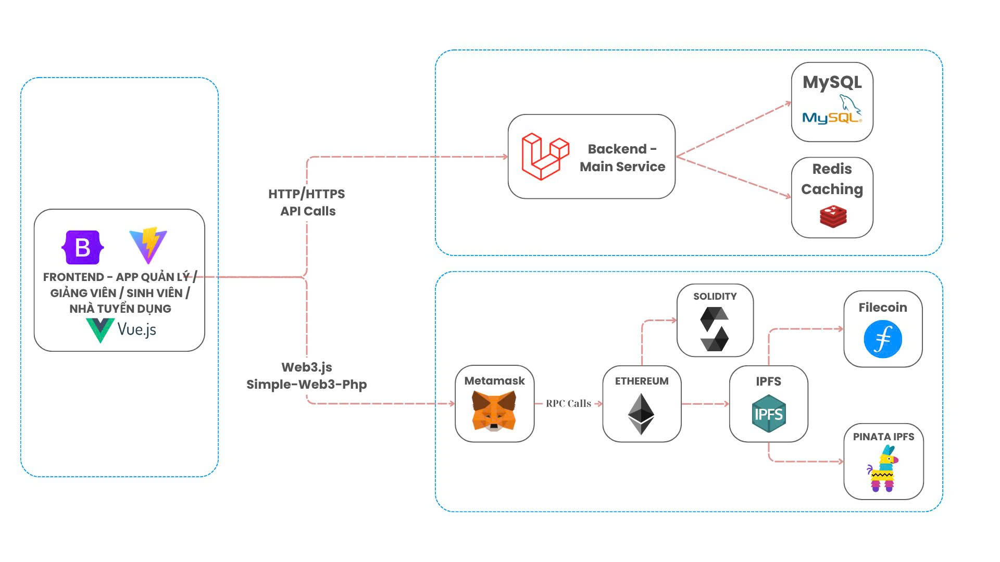

# Kiến trúc EduBridgeTrace

## 🏗️ Tổng quan hệ thống

EduBridgeTrace được thiết kế theo mô hình đa tầng, kết hợp công nghệ Web2 và Web3 để xây dựng một hệ sinh thái chứng nhận học thuật và tuyển dụng hoàn chỉnh.

## 🔄 Chi tiết các luồng xử lý

### 1. Luồng đăng nhập & quản lý dữ liệu

| Bước | Từ | Đến | Hoạt động |
|------|----|----|-----------|
| 1 | Frontend | Backend | Gửi yêu cầu Login/CRUD qua HTTPS |
| 2 | Backend | Redis | Kiểm tra cache phiên |
| 3 | Redis | Backend | Trả về kết quả cache hit/miss |
| 4 | Backend | MySQL | Truy vấn SQL (nếu cache miss) |
| 5 | MySQL | Backend | Trả về dữ liệu người dùng |
| 6 | Backend | Frontend | Trả về phản hồi JSON |

### 2. Luồng phát hành bằng cấp (NFT)

| Bước | Từ | Đến | Hoạt động |
|------|----|----|-----------|
| 1 | Frontend | MetaMask | Yêu cầu ký giao dịch NFT |
| 2 | MetaMask | Frontend | Hiển thị xác nhận từ người dùng |
| 3 | MetaMask | Ethereum | Gửi giao dịch lên blockchain |
| 4 | Ethereum | MetaMask | Trả về biên nhận và log sự kiện |
| 5 | MetaMask | Frontend | Thông báo kết quả thành công/thất bại |

### 3. Luồng lưu trữ file & metadata

| Bước | Từ | Đến | Hoạt động |
|------|----|----|-----------|
| 1 | Frontend | Backend | Upload file (CV, chứng chỉ, avatar) |
| 2 | Backend | AWS S3 | Lưu file tĩnh với bảo mật IAM |
| 3 | AWS S3 | Backend | Trả về URL và metadata của file |
| 4 | Backend | IPFS | Pin metadata qua Pinata |
| 5 | IPFS | Backend | Trả về hash bất biến |
| 6 | Backend | MySQL | Lưu hash vào database |
| 7 | Backend | Frontend | Thông báo hoàn tất upload |

### 4. Luồng xác thực bằng cấp

| Bước | Từ | Đến | Hoạt động |
|------|----|----|-----------|
| 1 | Frontend | Backend | Gửi yêu cầu xác thực bằng cấp |
| 2 | Backend | Ethereum | Truy vấn smart contract bằng token ID |
| 3 | Ethereum | Backend | Trả về thông tin NFT và chủ sở hữu |
| 4 | Backend | IPFS | Lấy metadata từ hash |
| 5 | IPFS | Backend | Trả về chi tiết bằng cấp (JSON) |
| 6 | Backend | Frontend | Trả kết quả xác thực + metadata |

## 🔧 Các thành phần chính

### Frontend Layer (Vue.js)
- Giao diện người dùng
- Tương tác Web3
- Responsive design

### Backend Layer (Laravel)
- REST API
- Business logic
- Authentication

### Cache Layer (Redis)
- Session storage
- Query cache
- Pub/sub messaging

### Database Layer (MySQL)
- Data persistence
- ACID transactions
- Backup/restore

### Storage Layer (AWS S3)
- File storage
- CDN delivery
- Version control

### Blockchain Layer (Ethereum)
- Smart contracts
- NFT management
- Transaction handling

### Distributed Storage (IPFS/Filecoin)
- Metadata storage
- Content addressing
- Data immutability

## 📚 Tài liệu kỹ thuật

### System Requirements
| Software | Minimum Version |
|----------|----------------|
| Laravel | 12x |
| Node.js | >=6.0.0 |
| Npm | 10.9.2 |
| MetaMask | 11.x |
| Axios | 1.8.2 |
| Vite | 6.2.4 |

## 🔐 Bảo mật

### Authentication
- JWT tokens
- MetaMask signatures
- Multi-factor auth

### Data Security
- Encryption at rest
- HTTPS everywhere
- IAM policies

### Access Control
- Role-based access
- Smart contract permissions
- API rate limiting

## 📈 Khả năng mở rộng

### Horizontal Scaling
- Load balancing
- Database replication
- Cache distribution

### Vertical Scaling
- Instance upgrades
- Storage optimization
- Performance tuning

## 🔄 Backup & Recovery

### Data Backup
- RDS automated backups
- S3 versioning
- Blockchain immutability

### Disaster Recovery
- Multi-region deployment
- Failover procedures
- Data restoration plan

## 📝 Documentation

### Technical Docs
- API documentation
- Smart contract specs
- Database schema

### User Guides
- Student manual
- Teacher guide
- Admin documentation

## 📝 License
Dự án được phân phối dưới giấy phép [MIT License](/LICENSE)

## 🪜 Hệ thống
Thiết kế theo kiến trúc như hình vẽ bên dưới:

## 👥 Đối tượng người dùng

| 👩‍🏫 Giảng viên | 🎓 Sinh viên | 💼 Nhà trường | 🏢 Nhà tuyển dụng |
|----------------|-------------|-------------------|-------------------|
| Phát hành và xác minh chứng chỉ | Lưu trữ & chia sẻ hồ sơ bất biến | Đảm bảo chất lượng học thuật | Xác thực & đánh giá ứng viên |

## 💡 Tính năng chính

### 🎓 Quản lý văn bằng
- Phát hành chứng chỉ NFT
- Xác minh tức thì
- Lưu trữ phi tập trung

### 👥 Tuyển dụng
- Hồ sơ ứng viên blockchain
- Xác thực tự động
- Kết nối doanh nghiệp-trường

### 🤝 Liên kết trường
- Chia sẻ dữ liệu học thuật
- Chuyển tiếp tín chỉ
- Xác thực liên trường

## 📞 Liên hệ

| Role      | Name                    | Email                                                                 |
| --------- | ----------------------- | --------------------------------------------------------------------- |
| Leader    | **Nguyễn Quốc Long**     | [quoclongdng@gmail.com](mailto:quoclongdng@gmail.com)                 |
| Developer | **Lê Thanh Trường**      | [thanhtruong23111999@gmail.com](mailto:thanhtruong23111999@gmail.com) |
| Developer | **Võ Văn Việt**          | [vietvo371@gmail.com](mailto:vietvo371@gmail.com)                     |
| Developer | **Nguyễn Văn Nhân**      | [vannhan130504@gmail.com](mailto:vannhan130504@gmail.com)             |
| Developer | **Nguyễn Ngọc Duy Thái** | [kkdn011@gmail.com](mailto:kkdn011@gmail.com)                         |

*"Được phát triển với ❤️ bởi Nhóm DTU-DZ"*
