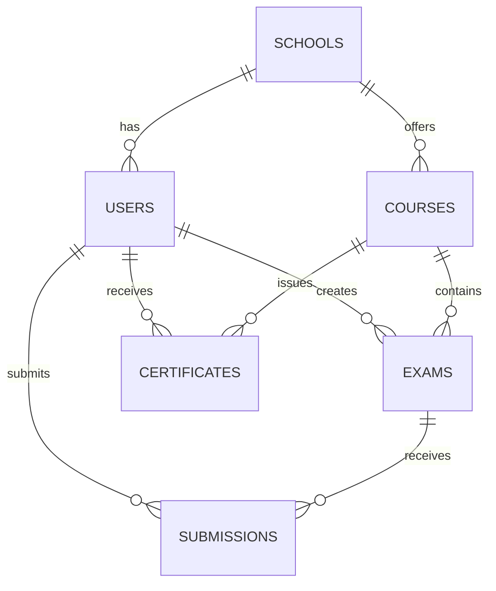

# Database Schema Documentation

## 📊 Overview

EduBridgeTrace sử dụng MongoDB làm cơ sở dữ liệu chính để lưu trữ thông tin off-chain. Dữ liệu được tổ chức theo các collection sau:

## 👥 Users Collection

```javascript
{
  _id: ObjectId,
  email: String,
  password: String, // Hashed
  role: String, // "student" | "instructor" | "school" | "employer"
  name: String,
  walletAddress: String,
  createdAt: Date,
  updatedAt: Date,
  
  // Specific fields based on role
  student: {
    studentId: String,
    school: ObjectId,
    major: String,
    enrollmentYear: Number
  },
  
  instructor: {
    employeeId: String,
    school: ObjectId,
    department: String,
    specialization: String
  }
}
```

## 🏫 Schools Collection

```javascript
{
  _id: ObjectId,
  name: String,
  code: String,
  address: String,
  walletAddress: String,
  admins: [ObjectId], // Reference to Users
  createdAt: Date,
  updatedAt: Date,
  
  // Blockchain related
  contractAddress: String,
  issuerRole: String
}
```

## 📚 Courses Collection

```javascript
{
  _id: ObjectId,
  code: String,
  name: String,
  description: String,
  credits: Number,
  school: ObjectId,
  department: String,
  instructor: ObjectId,
  
  // Academic info
  semester: String,
  year: Number,
  startDate: Date,
  endDate: Date
}
```

## 📝 Exams Collection

```javascript
{
  _id: ObjectId,
  course: ObjectId,
  title: String,
  description: String,
  instructor: ObjectId,
  
  // Blockchain info
  tokenId: String,
  ipfsHash: String,
  contractAddress: String,
  
  // Timing
  startTime: Date,
  endTime: Date,
  publishedAt: Date,
  
  // Status
  status: String, // "draft" | "published" | "active" | "completed"
  
  // Settings
  duration: Number,
  maxAttempts: Number,
  passingScore: Number
}
```

## 📋 Submissions Collection

```javascript
{
  _id: ObjectId,
  exam: ObjectId,
  student: ObjectId,
  submittedAt: Date,
  
  // Answer data
  answers: [{
    questionId: String,
    answer: String,
    score: Number
  }],
  
  // Blockchain info
  resultHash: String,
  transactionHash: String,
  
  // Grading
  totalScore: Number,
  feedback: String,
  gradedBy: ObjectId,
  gradedAt: Date,
  
  // Review
  reviewRequested: Boolean,
  reviewStatus: String,
  reviewFeedback: String
}
```

## 🎓 Certificates Collection

```javascript
{
  _id: ObjectId,
  student: ObjectId,
  course: ObjectId,
  school: ObjectId,
  
  // Academic info
  grade: String,
  issueDate: Date,
  expiryDate: Date,
  
  // Blockchain info
  tokenId: String,
  ipfsHash: String,
  contractAddress: String,
  transactionHash: String,
  
  // Metadata
  metadata: {
    type: String,
    achievements: [String],
    skills: [String]
  },
  
  // Verification
  verificationCount: Number,
  lastVerifiedAt: Date
}
```

## 🔄 Relationships



## 🔒 Indexes

### Users Collection
```javascript
{
  email: 1,
  unique: true
}
{
  walletAddress: 1,
  sparse: true
}
```

### Exams Collection
```javascript
{
  course: 1,
  startTime: 1
}
{
  tokenId: 1,
  unique: true,
  sparse: true
}
```

### Certificates Collection
```javascript
{
  tokenId: 1,
  unique: true
}
{
  student: 1,
  course: 1
}
```

## 🔐 Data Validation

### Users Schema Validation
```javascript
{
  $jsonSchema: {
    required: ["email", "password", "role", "name"],
    properties: {
      email: {
        bsonType: "string",
        pattern: "^[a-zA-Z0-9._%+-]+@[a-zA-Z0-9.-]+\\.[a-zA-Z]{2,}$"
      },
      role: {
        enum: ["student", "instructor", "school", "employer"]
      }
    }
  }
}
```

### Certificates Schema Validation
```javascript
{
  $jsonSchema: {
    required: ["student", "course", "school", "grade"],
    properties: {
      grade: {
        enum: ["A", "B", "C", "D", "F"]
      },
      tokenId: {
        bsonType: "string",
        pattern: "^0x[a-fA-F0-9]{40}$"
      }
    }
  }
}
```

## 📊 Sample Queries

### Get Student's Certificates with Course Info
```javascript
db.certificates.aggregate([
  {
    $match: {
      student: studentId
    }
  },
  {
    $lookup: {
      from: "courses",
      localField: "course",
      foreignField: "_id",
      as: "courseInfo"
    }
  }
])
```

### Get Active Exams for Student
```javascript
db.exams.aggregate([
  {
    $match: {
      status: "active",
      startTime: { $lte: new Date() },
      endTime: { $gte: new Date() }
    }
  },
  {
    $lookup: {
      from: "courses",
      localField: "course",
      foreignField: "_id",
      as: "courseInfo"
    }
  }
])
```

## 🔄 Data Migration

### Version Control
- Use semantic versioning for schema changes
- Maintain migration scripts
- Test migrations on staging first

### Backup Strategy
- Daily automated backups
- Point-in-time recovery
- Geo-redundant storage

## 📈 Performance Optimization

### Indexing Strategy
- Create indexes based on common queries
- Use compound indexes for frequently combined fields
- Monitor and update indexes based on usage

### Caching
- Implement application-level caching
- Use MongoDB's built-in caching
- Cache blockchain data when possible 