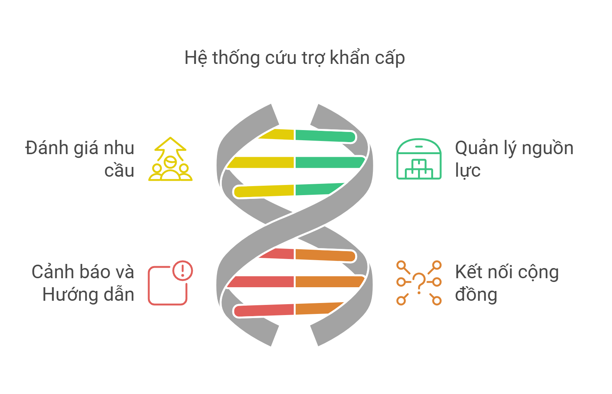
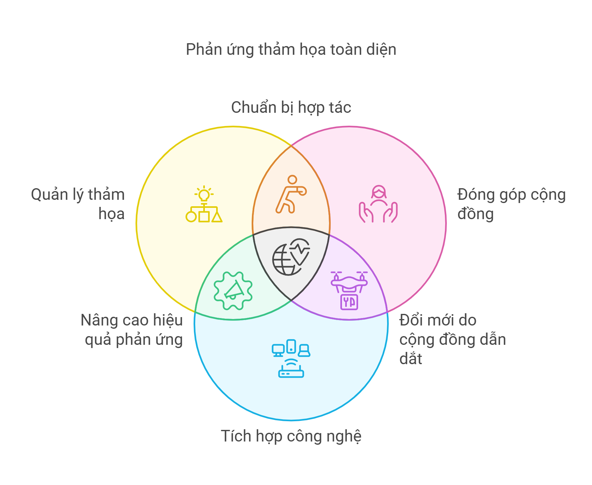

# Tổng quan

> *"💚 Ấn nút nhớ, thả hy vọng 🌿"*

Ứng dụng hỗ trợ cứu nạn khẩn cấp và quản lý nguồn lực
  Mục tiêu của dự án là phát triển một hệ thống dựa trên `nền tảng LCDP` để hỗ trợ cứu nạn cứu trợ khẩn cấp, quản lý nguồn lực cứu trợ và quản lý tái thiết sau thảm họa.

Dự án được thực hiện trong cuộc thi [ Phần Mềm Nguồn Mở-Olympic Tin học Sinh viên Việt Nam 2024](https://www.olp.vn/procon-pmmn/ph%E1%BA%A7n-m%E1%BB%81m-ngu%E1%BB%93n-m%E1%BB%9F)
. Được open source theo giấy phép [MIT License](https://github.com/NguyenThai11103/DTU-Relieflink-documents/blob/main/LICENSE
) bởi đội tác giả DTU_DZ.

**`RELIEFLINK`** Dự án cứu nạn khẩn cấp nhằm xây dựng một hệ thống hiệu quả để cung cấp các dịch vụ cứu trợ khẩn cấp và quản lý tài nguyên trong các tình huống thảm họa. Hệ thống này sử dụng công nghệ bản đồ để theo dõi và phân phối tài nguyên như thực phẩm, nước, và thuốc men, giúp các đội cứu hộ phản ứng nhanh chóng và chính xác. Các tính năng của hệ thống bao gồm việc tự động phân phối tài nguyên theo nhu cầu và vị trí, cung cấp giao diện người dùng thân thiện dựa trên `NỀN TẢNG LCDP` để quản lý và điều phối hoạt động cứu hộ, đồng thời phân tích dữ liệu thời gian thực để đưa ra các quyết định kịp thời. Mục tiêu của dự án là tối ưu hóa quy trình cứu trợ, giảm thiểu thời gian phản ứng và đảm bảo rằng các nạn nhân nhận được sự hỗ trợ kịp thời nhất.

# 💫 Tại sao RELIEFLINK sẽ thay đổi cuộc sống của bạn

- 🚨 Hỗ trợ cứu nạn thông minh: Chúng tôi tin rằng mỗi giây phút đều quan trọng trong tình huống khẩn cấp. Hệ thống của chúng tôi tích hợp công nghệ tiên tiến, giúp phản ứng nhanh chóng và chính xác như một đội cứu hộ chuyên nghiệp! Từ việc xác định nhu cầu cứu trợ đến kết nối với các dịch vụ khẩn cấp, RELIEFLINK đảm bảo rằng không ai bị bỏ lại phía sau.

- 🎯 Quản lý nguồn lực hiệu quả: RELIEFLINK tối ưu hóa việc phân phối nguồn lực cứu trợ, đảm bảo sự hỗ trợ đến đúng nơi, đúng lúc. Với khả năng phân tích tình hình và đánh giá hiệu quả cứu trợ, chúng tôi giúp bạn quản lý tài nguyên một cách thông minh và bền vững.

- ⚡ Cảnh báo sớm thông minh: Biến thông tin thành hành động với hệ thống cảnh báo sớm tiên tiến. Theo dõi và dự báo thảm họa theo thời gian thực để bảo vệ cộng đồng.  Hệ thống thông báo khẩn cấp chúng tôi giúp bạn luôn sẵn sàng ứng phó với mọi tình huống, từ thiên tai đến các sự kiện bất ngờ.

- 🤝 Kết nối cộng đồng mạnh mẽ: Xây dựng mạng lưới hỗ trợ rộng khắp với nền tảng kết nối tình nguyện viên và nguồn lực. RELIEFLINK không chỉ là một công cụ, mà còn là cầu nối giữa những người cần giúp đỡ và những người sẵn sàng hỗ trợ, tạo nên một cộng đồng đoàn kết và vững mạnh.

- 🌍 Tầm nhìn dài hạn: RELIEFLINK không chỉ dừng lại ở việc cứu trợ khẩn cấp mà còn hướng tới tái thiết và phục hồi sau thảm họa. Với sự tích hợp của công nghệ tiên tiến như IoT và phân tích dữ liệu lớn, chúng tôi cam kết mang lại sự phát triển bền vững và an toàn cho cộng đồng trên toàn thế giới.

### 🔍 Các tính năng chính

#### 🌪 Cứu trợ khẩn cấp
- Xác định nhu cầu cứu trợ
- Phân phối cứu trợ
- Theo dõi tiến độ
- Kết nối với các dịch vụ khẩn cấp
#### 💰Quản lý nguồn lực
- Phân tích tình hình 
- Phân phối tài nguyên
- Báo cáo kết quả
- Thông tin về các dịch vụ hỗ trợ và tài nguyên
#### ⚠️ Cảnh báo và hướng dẫn
- Hệ thống thông báo khẩn cấp
- Cảnh báo sớm về thảm họa
- Hướng dẫn ứng phó với thảm họa
- Giao tiếp trong tình huống khẩn cấp
#### 🤝 Kết nối cộng đồng
- Kết nối nhu cầu và nguồn lực
- Nền tảng tình nguyện viên
- Hệ thống điều phối cứu trợ
- Mạng lưới hỗ trợ khẩn cấp

### 🔬 Các lĩnh vực nghiên cứu

#### 🏃 Xây dựng hệ thống ứng cứu hiệu quả 
- Quản lý thảm họa
- Tương tác giữa đội cứu hộ và người cần cứu trợ
- Kinh tế cứu trợ thảm họa 
- Quản lý tình nguyện và lực lượng hỗ trợ
- Phân tích dữ liệu cộng đồng
- Hỗ trợ ra quyết định kịp thời và chính xác
#### 🌳 Đóng góp cộng đồng
- Hỗ trợ xây dựng cộng đồng
- Nâng cao năng lực ứng phó của cộng đồng
- Tối ưu hóa việc sử dụng nguồn lực địa phương
- Nâng cao ý thức phòng chống thiên tai trong cộng đồng
- Phát triển các phương pháp cứu trợ hiệu quả và bền vững
#### 🧠  Tích hợp công nghệ
- Hệ thống quản lý và dự báo tích hợp
- Dẫn đường và chỉ dẫn

 

##  📌 Các đặc điểm nổi bật  và lợi ích cho người dùng
- **Cảnh báo sớm và dự báo thiên tai** : Hệ thống cảnh báo sớm giúp giảm thiểu thiệt hại về người và tài sản, đồng thời tăng cường khả năng chuẩn bị của cộng đồng trước thiên tai.
- **Ứng phó tình huống khẩn cấp**  : Các phương án ứng phó khẩn cấp được triển khai nhanh chóng và hiệu quả nhờ vào công nghệ hiện đại, giúp cứu sống nhiều người và giảm thiểu rủi ro cho các đội cứu hộ.
- **Tác động tích cực trên nhiều khía cạnh** :  Xã hội , kinh tế , môi trường, công nghệ.
- **Đối với cộng đồng và người dân** : Tham gia vào các chương trình đào tạo và tập huấn về ứng phó thiên tai.Chủ động tìm hiểu về các biện pháp phòng tránh và ứng phó với thiên tai.Hỗ trợ lẫn nhau trong các tình huống khẩn cấp, đặc biệt là các nhóm dễ bị tổn thương như người già, trẻ em, và người khuyết tật.
- **Đối với các doanh nghiệp và nhà đầu tư** : Hỗ trợ tài chính và công nghệ để phát triển và triển khai các giải pháp của dự án.Đóng góp vào các hoạt động cứu trợ và tái thiết như một phần của trách nhiệm xã hội doanh nghiệp.

       *`RELIEFLINK`* không chỉ là một dự án hỗ trợ khẩn cấp mà còn là một lời kêu gọi hành động – hành động vì sự an toàn của cộng đồng, vì sự phát triển bền vững của đất nước, và vì tương lai của thế hệ mai sau.

## 🌏 Mục tiêu tương lai của dự án 

-  **Tăng cường năng lực ứng phó với thảm họa** : Hệ thống có thể trở thành một công cụ quan trọng cho các quốc gia thường xuyên chịu ảnh hưởng bởi thiên tai, giúp nâng cao khả năng ứng phó nhanh chóng và giảm thiểu thiệt hại.Mở rộng ứng dụng cho các tình huống khẩn cấp khác, như dịch bệnh, khủng hoảng nhân đạo, hoặc các sự kiện bất ngờ.
- **Phát triển thành một nền tảng quốc tế** : Dự án có tiềm năng trở thành một hệ thống tiêu chuẩn, được sử dụng bởi các tổ chức quốc tế và các tổ chức nhân đạo khác để phối hợp cứu trợ trên toàn cầu.
- **Ứng dụng trí tuệ nhân tạo và phân tích dữ liệu lớn** : Sử dụng AI để phân tích và dự đoán thảm họa, từ đó cải thiện khả năng chuẩn bị và ứng phó trước khi thảm họa xảy ra. Phân tích dữ liệu lớn (Big Data) để tối ưu hóa việc phân bổ nguồn lực, dự đoán nhu cầu cứu trợ và đánh giá hiệu quả của các hoạt động cứu trợ
- **Mở rộng sang lĩnh vực tái thiết và phục hồi** : Hệ thống không chỉ dừng lại ở giai đoạn cứu trợ mà còn hỗ trợ tái thiết cơ sở hạ tầng và khôi phục kinh tế sau thảm họa. Tích hợp công nghệ để quản lý việc tái thiết, đảm bảo tính bền vững và lâu dài cho các cộng đồng bị ảnh hưởng.
- **Khai thác các công nghệ tiên tiến** : Ứng dụng IoT (Internet of Things) để thu thập dữ liệu thời gian thực từ các cảm biến và thiết bị thông minh, giúp cải thiện độ chính xác trong việc phát hiện và đánh giá thảm họa.

Với những tiềm năng này, dự án có thể trở thành một nền tảng toàn diện và hiệu quả để hỗ trợ không chỉ trong cứu trợ khẩn cấp mà còn trong việc xây dựng khả năng phục hồi lâu dài cho các cộng đồng trên toàn thế giới.

## 🌿 Kỳ vọng tương lai
        -   Ứng dụng này hướng tới các mục tiêu xây dựng một hệ thống phản ứng nhanh chóng,cải thiện khả năng đánh giá và đáp ứng nhu cầu cứu trợ ngay khi thảm họa xảy ra, rút ngắn thời gian từ khi thảm họa bắt đầu đến khi hỗ trợ được cung cấp. hiệu quả và bền vững, giúp cộng đồng đối phó tốt hơn với các thảm họa.Hệ thống sẽ tìm cách phát triển các nguồn lực bền vững như các quỹ cứu trợ dài hạn, các sáng kiến tái thiết và phục hồi sau thiên tai, giúp cộng đồng nhanh chóng phục hồi sau thảm họa và có thể đối phó tốt hơn với thảm họa trong tương lai.Đóng góp một phần vào việc xây dựng cộng đồng.

## 💡Nhà phát triển

- 📧 Email: thanhtruong23111999@gmail.com

- 📱 Hotline: 0376 659 652

*" 🏫 DTU_DZ - DUY TAN UNIVERSITY - SCS ✨"*

## 📞 Liên hệ
- Lê Thanh Trường       :  <u>thanhtruong23111999@gmail.com</u>
- Võ Văn Việt           :  <u>vietvo371@gmail.com</u>
- Nguyễn Ngọc Duy Thái  :  <u>kkdn011@gmail.com</u>

## 📚 Tài liệu
- [Hướng dẫn cài đặt](https://github.com/Truongpyeo/DTURelifeLink/blob/master/docs/setup.md)

## 🤝 Đóng góp
Chúng tôi rất hoan nghênh mọi đóng góp! Xem [CONTRIBUTING](https://github.com/NguyenThai11103/DTU-Relieflink-documents/blob/main/CONTRIBUTING.md
) để biết thêm chi tiết.

## 🔄 Quy trình phát triển
1. Fork repo này
2. Tạo branch mới (`git checkout -b feature/AmazingFeature`)
3. Commit thay đổi (`git commit -m 'Add some AmazingFeature'`)
4. Push lên branch (`git push origin feature/AmazingFeature`) 
5. Tạo Pull Request

## 🐛 Báo lỗi
Nếu bạn phát hiện lỗi, vui lòng tạo issue mới với:
- Mô tả chi tiết lỗi
- Các bước tái hiện
- Screenshots nếu có
- Môi trường (browser, OS...)

## 📜 Changelog
Xem [CHANGELOG](https://github.com/NguyenThai11103/DTU-Relieflink-documents/blob/main/CHANGELOG.md) để biết lịch sử thay đổi.

## ⚖️ Code of Conduct
Xem [CODE_OF_CONDUCT](https://github.com/NguyenThai11103/DTU-Relieflink-documents/blob/main/CODE_OF_CONDUCT.md
) để biết các quy tắc và hành vi được chấp nhận.

## Báo cáo lỗi & Góp ý
- Issues: [GitHub Issues](https://github.com/Truongpyeo/DTURelifeLink/issues)
- Security: Đối với các vấn đề bảo mật nhạy cảm, vui lòng liên hệ trực tiếp qua email: <u>thanhtruong23111999@gmail.com</u>

### 📝 License
Dự án được phân phối dưới giấy phép [MIT License](https://github.com/NguyenThai11103/DTU-Relieflink-documents/blob/main/LICENSE
)

*"Được phát triển với ❤️ bởi Nhóm DTU-DZ"*

